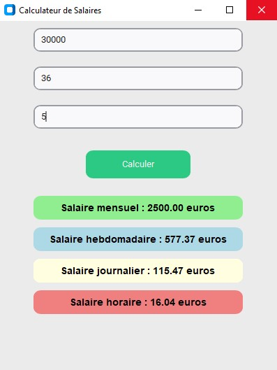

# Calculateur de Salaires

Cette application est un projet simple développé pour apprendre à utiliser les bibliothèques Python telles que Tkinter pour les interfaces graphiques et PyInstaller pour la création d'exécutables. Elle permet de calculer les salaires mensuels, hebdomadaires, journaliers et horaires en fonction des entrées de l'utilisateur.

### Objectifs d'Apprentissage

- **Tkinter :** Création d'interfaces graphiques conviviales avec des widgets tels que des labels, des boutons, et des champs de saisie.
- **PyInstaller :** Transformation de scripts Python en exécutables autonomes pour une distribution facile.
- **Gestion des Données :** Traitement des entrées utilisateur et calculs simples pour des applications pratiques.

## Fonctionnalités

- Calcul du salaire mensuel
- Calcul du salaire hebdomadaire
- Calcul du salaire journalier
- Calcul du salaire horaire

## Screenshots

### Écran Principal

### Calcul des Différents Salaires

